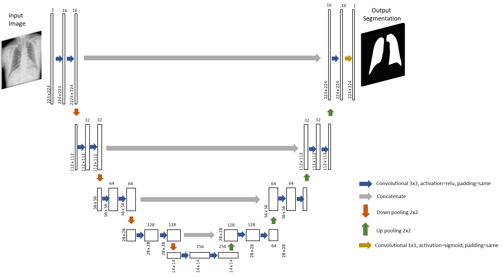

# TFM-NN-Medical-Classifier

## Este respositorio tiene como objetivo contener el código que se ha necesitado para la elaboración del TFM, de donde se desprenden los puntos siguientes:

* [Convolutional-Regular](/Convolutional-Regular): 
 Se muestra el código utilizado para desarrollar cuatro propuestas genuinas de redes convolucionales para la clasificación de acuerdo a las cuatro clases de estudio. 

1. Red Convolucional 1: Red convolucional clásica
2. Red Convolucional 2: Red convolucional clásica con class weight para disminuir el efecto del dataset desequilibrado.
3. Red Convolucional 3: Red convolucional clásica con más filtro convolucionales en las capas iniciales para reforzar la captación de patrones en los pulmones.
4. Red Convolucional 4: Red convolucional clásica con más filtros en todas sus capas.

* [Transfer Learning](/Transfer-Learning): Código que recoge los cinco modelos preentrenados estudiados que a su vez se dividen en tres casos:

1. Modelo Base
2. Modelo Base + 2 capas densas
3. Modelo Base + 2 capas densas + últimas capas entrenables

* [Segmentación](/Segmentacion): Como trabajo paralelo se plantea la posibilidad de usar un segmentador mediante el desarrollo de una nueva red de visión artificial denominada `Unet` que permitirá crear máscaras a cada imagen dividiéndola en dos área [0:negro, 1:blanco]. Una vez creada la segmentación se aplica al dataset original superponiendo máscar y original. Siguiendo las lecciones aprendidas de apartados anteriores solo se han estudiado tres arquitecturas de red de acuerdo con este nuevo dataset. [redes propuestas](/Segmentacion/Conv-Regular).

* [Visualización de capas convolucionales](/Layers-Visualization): El código describe la metodología necesaria para visualizar la salida de las capas convolucionales, permitiéndonos entender con mayor profundidad los patrones aprendidos por cada filtro. 

* [GradCAM](/Grad-CAM): Con esta técnica se consigue visualizar a través de un mapa de colores la última capa convolucional de una determinada red pudiendo intuir las principales características que el clasificador ha determinado genuinas para esa categoría e imagen en particular. 
:

* [Applicación](/app): Se presenta el modelo de una aplicación sencilla que trata de recoger la esencia de este trabajo, ofrecer una alternativa viables a un problema de aprendizaje automático. Esta aplicación tiene un funcionamiento sencillo, nos pedirá la radiografía a analizar y devolverá la afección predicha junto con la imagen original y un mapa de colores de acuerdo a la técnica gradCAM indicando los puntos críticos de dicha imagen.
[Lung-Disease-Classifier-app](https://tfm-tdda2pscka-ew.a.run.app/)

* [Visual Transformer](/ViT): Esta técnica todavía incipiente ofrece un nuevo enfoque para la resolución de problemas de visión artificial basado en el `embedding` y el concepto de atención que permite encontrar relaciones entre las partes esenciales del modelo, los denominados `patches`.

- División de una imágen en 196 `patches` de tamaño 16x16:

